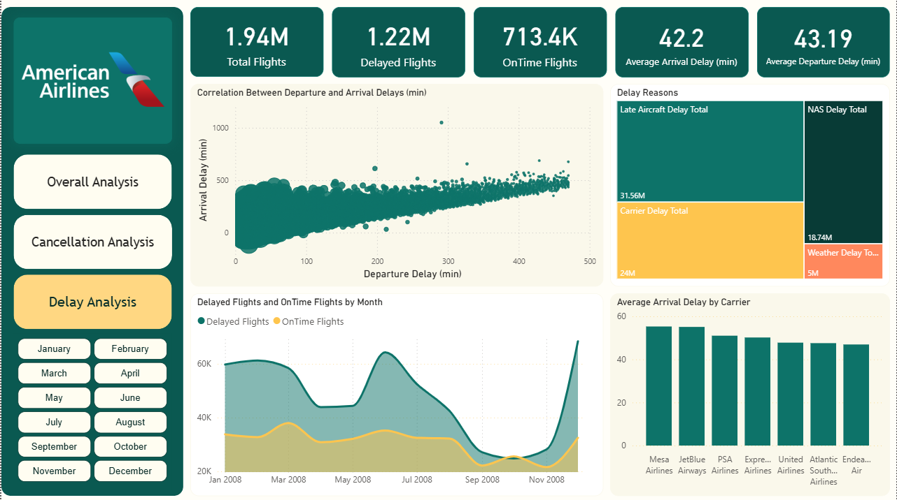

# Airlines Delayed 2008 - Power BI Analysis

This project presents a comprehensive analysis of U.S. airline delays in the year 2008. Using Power BI, we explored around 2 million flight records to uncover trends, causes of delays, cancellations, and diversions. The interactive dashboards provide actionable insights for improving airline operations and passenger experience.

---

## Interactive Project
You Can find the project and interact with it on novypro,
here's the link
[Interactive Dashboard](https://project.novypro.com/40ZidP)

---

## Table of Contents

1. [Project Objectives](#project-objectives)  
2. [Dataset Description](#dataset-description)  
3. [Tools Used](#tools-used)  
4. [Data Preparation & Modeling](#data-preparation--modeling)  
5. [Dashboard Pages](#dashboard-pages)  
   - [General Analysis](#1-general-analysis)  
   - [Cancellation & Diversion Analysis](#2-cancellation--diversion-analysis)  
   - [Delay Analysis](#3-delay-analysis)  
6. [How to Use](#how-to-use)  
7. [License & Author](#license--author)  

---

## Project Objectives

- Visualize and analyze large-scale flight delay data for 2008.
- Identify the most frequent causes of delays and cancellations.
- Understand patterns across time, carriers, and airports.
- Create a report structure using bookmarks to improve user navigation.
- Share insights via Power BI Report Server or GitHub.

---

## Dataset Description

- **Source:** U.S. Department of Transportation – Bureau of Transportation Statistics  
- **Year:** 2008  
- **Size:** Over 7 million flight records  
- **Features include:**  
  - Flight dates, times, distances  
  - Delay causes (weather, carrier, NAS, security, late aircraft)  
  - Cancellations and diversions  
  - Airports and carrier codes  

---

## Tools Used

- **Power BI Desktop** (visualization & modeling)  
- **Power Query** (data cleaning & transformation)  
- **DAX** (for calculated measures and KPIs)  
- **Power BI Report Server** (deployment)  

---

## Data Preparation & Modeling

We used Power Query to clean and transform the raw datasets. Several dimension tables were created for a star schema model, including:

- `DimCarrier`
- `DimAirport`
- `DimDate`
- `DimFlightStatus`

A fact table (`FactFlights`) holds the flight-level data.

### Data Model Structure:

---

## Dashboard Pages

### 1. General Analysis

This page provides a high-level overview of flight performance:

- Total flights, on-time, delayed, cancelled, and diverted flights.
- Monthly trends and airline comparisons.
- Geographic distribution of affected flights.

---

### 2. Cancellation & Diversion Analysis

This view focuses on identifying:

- Primary causes of flight cancellations (weather, carrier, etc.).
- Distribution of diverted flights across airports and airlines.

---

### 3. Delay Analysis

This section breaks down delay causes:

- Average delay time by cause (weather, carrier, etc.)
- Delay patterns by airline, airport, and day of the week.
- Visuals include bar charts, boxplots, and heatmaps.

---

## 🔗 Connect with Me

- [NovyPro](https://my.novypro.com/mohamed-saeed-1)
- [LinkedIn](https://www.linkedin.com/in/mohammed-saeed-4148b423b/)
- [GitHub](https://github.com/Mohamedsaeed12-5)

  
